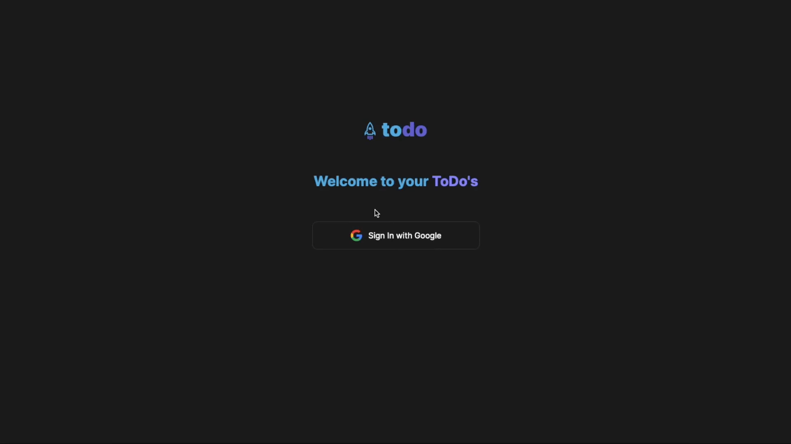

<h1 align="center">
  
</h1>




<h1 align="center">
    ToDo App
</h1>
<p align="center">Create your ToDo list 🚀</p>

## About this project

This project was made during the Ignite React course from Rocketseat, this project has the goal to fix fundamentals of React using Typescript

---

## Technologies 👩‍💻

Thecnologies used in this project

- [ReactJS](https://reactjs.org/)
- [TypeScript](https://www.typescriptlang.org/)
- [UUID](https://github.com/uuidjs/uuid#readme)
---

## Requirements

It is necessary to have installed on your machine

- [Git](https://git-scm.com/)
- [Yarn](https://classic.yarnpkg.com)
- [Node](https://nodejs.org/en/)


## Starting 🚀

```bash
# Clone this project
$ git clone https://github.com/Artur-Ceschin/ToDo-Ignite-App.git

# Access
$ cd ignite-todo

# Install dependencies
$ yarn

# Run the project
$ yarn dev

# The server will initialize in the <http://localhost:3000>
```

---

## License📃

This project is under license from MIT. For more details, see the [LICENSE](./LICENSE.md) file.

### Author

---

Made with ❤️ by Artur Ceschin 👋🏼 Please fell free to contact me!
<br/>
[](https://www.linkedin.com/in/artur-peres-ceschin-programador/)
[](mailto:artur.ceschin@gmail.com)